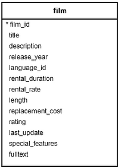

## OVER CLAUSE

- Klein voorbeeldje want de slides van Dhr. Bertels zijn weer useless as fuck

```
SELECT sale_day, sale_time,
       branch, article, quantity, revenue,
       SUM(quantity) OVER (PARTITION BY article) AS total_units_sold
FROM  sales
```

- Je kan dus in de `OVER` clausule basically 2 dingen aan meegeven:
    - `PARTITION BY`: Bepaalt de groepen waarin de rijen gaan verdeeld worden.
    - `ORDER BY`: Bepaalt de volgorde van de groepen.

## RANK CLAUSE

- Stel je hebt een table 'Animal_groups' en een tabel 'Mammals' met de volgende kolommen:

- Voor illustratieve doeleinden zet ik ook even de tabellen met data erin.

```sql
CREATE TABLE Animal_groups (
    animal_id serial PRIMARY KEY,
    animal_name VARCHAR (255) NOT NULL
);

CREATE TABLE Mammals (
    mammal_id serial PRIMARY KEY,
    mammal_name VARCHAR (255) NOT NULL,
    lifespan DECIMAL (11, 2),
    animal_id INT NOT NULL,
    FOREIGN KEY (animal_id) REFERENCES Animal_groups (animal_id)
);
```

```sql
INSERT INTO Animal_groups (animal_name)
VALUES
    ('Terrestrial'),
    ('Aquatic'),
    ('Winged');

INSERT INTO Mammals(mammal_name, animal_id, lifespan)
VALUES
    ('Cow', 1, 10),
    ('Dog', 1, 7),
    ('Ox', 1, 13),
    ('Wolf', 1, 11),
    ('Blue Whale', 2, 80),
    ('Dolphin', 2, 5),
    ('Sea Horse', 2, 3),
    ('Octopus', 2, 8),
    ('Bat', 3, 4),
    ('Flying Squirrels', 3, 1),
    ('Petaurus', 3, 2);
```

- Nu kunnen we eigenlijk de `RANK` clausule gaan gebruiken. Spannend hé!

```sql
SELECT
    mammal_id,
    mammal_name,
    lifespan,
    RANK () OVER ( 
        ORDER BY lifespan DESC
    ) long_life 
FROM
    Mammals;
```

De output gaat dit zijn:

| mammal_id | mammal_name | lifespan | long_life |
| ---------|-------------|-----------|--------- |
| 5 | Blue Whale | 80.00 | 1 |
| 3 | Ox | 13.00 | 2 |
| 4 | Wolf | 11.00 | 3 |
| 1 | Cow | 10.00 | 4 |
| 8 | Octopus | 8.00 | 5 |
| 2 | Dog | 7.00 | 6 |
| 6 | Dolphin | 5.00 | 7 |
| 9 | Bat | 4.00 | 8 |
| 7 | Sea Horse | 3.00 | 9 |
| 11 | Petaurus | 2.00 | 10 |
| 10 | Flying Squirrels | 1.00 | 11 |

> - Wat uw RANK clausule eigenlijk gaat doen is het volgende in de query hier is:
>    - Ken een rang toe te kennen aan elk zoogdier volgens zijn levensduur.

## DENSE_RANK CLAUSE

- Stel je hebt hier een table `products` en `group_name`.
    
- Voor illustratieve doeleinden zet ik ook even de tabellen met data erin.

```sql
CREATE TABLE product_groups (
    group_id serial PRIMARY KEY,
    group_name VARCHAR (255) NOT NULL
);

CREATE TABLE products (
    product_id serial PRIMARY KEY,
    product_name VARCHAR (255) NOT NULL,
    price DECIMAL (11, 2),
    group_id INT NOT NULL,
    FOREIGN KEY (group_id) REFERENCES product_groups (group_id)
);
```

```sql	
INSERT INTO product_groups (group_name)
VALUES
    ('Smartphone'),
    ('Laptop'),
    ('Tablet');

INSERT INTO products (product_name, group_id, price)
VALUES
    ('Microsoft Lumia', 1, 200),
    ('HTC One', 1, 400),
    ('Nexus', 1, 500),
    ('iPhone', 1, 900),
    ('HP Elite', 2, 1200),
    ('Lenovo Thinkpad', 2, 700),
    ('Sony VAIO', 2, 700),
    ('Dell Vostro', 2, 800),
    ('iPad', 3, 700),
    ('Kindle Fire', 3, 150),
    ('Samsung Galaxy Tab', 3, 200);
```

- Nu kunnen we eigenlijk de `DENSE_RANK` clausule gaan gebruiken. Supercool!

```sql
SELECT
    product_id,
    product_name,
    price,
    DENSE_RANK () OVER ( 
        ORDER BY price DESC
    ) price_rank 
FROM
    products;
```

- Geeft de volgende output:

| product_id | product_name | price | price_rank |
| -----------|-------------|-------|-----------|
| 5 | HP Elite | 1200.00 | 1 |
| 4 | iPhone | 900.00 | 2 |
| 8 | Dell Vostro | 800.00 | 3 |
| 6 | Lenovo Thinkpad | 700.00 | 4 |
| 7 | Sony VAIO | 700.00 | 4 |
| 9 | iPad | 700.00 | 4 |
| 3 | Nexus | 500.00 | 5 |
| 2 | HTC One | 400.00 | 6 |
| 11 | Samsung Galaxy Tab | 200.00 | 7 |
| 1 | Microsoft Lumia | 200.00 | 7 |
| 10 | Kindle Fire | 150.00 | 8 |

- Wat uw DENSE_RANK clausule eigenlijk gaat doen is het volgende:
    - Gaat toegepast worden op elke rij in elke partitie die gedefinieerd wordt door de PARTITION BY-clausule, in de sorteervolgorde die gespecificeerd wordt door de ORDER BY-clausule.
    
_Als je er een betere uitleg voor hebt, mag je het aanvullen._

## ROWS Clause

- Basically heb je een table met een aantal rijen.

- Met uw ROWS ga je uw venster-kader te specificeren in relatie tot de huidige rij. 

> - 5 opties:
>   - `UNBOUNDED PRECEDING` &rarr; Alle rijen vóór de huidige rij.
>   - `CURRENT ROW` &rarr; De huidige rij.
>   - `UNBOUNDED FOLLOWING` &rarr; Alle rijen na de huidige rij.
>   - `n PRECEDING` &rarr; n rijen vóór de huidige rij.
>   - `n FOLLOWING` &rarr; n rijen na de huidige rij.


### UNBOUNDED PRECEDING AND CURRENT ROW

- **Is het nog steeds niet duidelijk? Geen probleem hier een voorbeeld**

> Dus stel je hebt een tabel `sales` met data van een boekenwinkel.

> - De tabel heeft de volgende kolommen:

| record_id | date | revenue |
| ----------|------|---------|
| 1 | 2021-09-01 | 1545.45 |
| 2 | 2021-09-02 | 2345.35 |
| 3 | 2021-09-03 | 903.99  |
| 4 | 2021-09-04 | 2158.55 |
| 5 | 2021-09-05 | 1819.80 |

> - Stel je wilt nu een andere kolom toevoegen met een kolom die de totale inkomsten toont vanaf de eerste tot de laatste datum van de tabel. Dan gebruik je dus `ROWS BETWEEN UNBOUNDED PRECEDING AND CURRENT ROW`.

```sql
SELECT date, revenue,
    SUM(revenue) OVER (
      ORDER BY date
      ROWS BETWEEN UNBOUNDED PRECEDING AND CURRENT ROW) running_total
FROM sales
ORDER BY date;
```

_Niet zeker van het volgende maar als je de rijen wilt zien vanaf de eerste tot de voorlaatste datum, dan gebruik je de `UNBOUNDED PRECEDING` optie. Dus zonder de `ROWS BETWEEN`-clausule._ 

### UNBOUNDED FOLLOWING

> - We gebruiken hier de tabel `weather`


| record_id | date | city |temperature precipitation |
| ----------|------|------|--------------------------|
| 101 | 2021-09-01  | Rome  | 18.5 | 7 |
| 102 | 2021-09-01 | Florence |17.3 | 5 |
| 103 | 2021-09-02 | Rome | 18.0 | 20 |
| 104 | 2021-09-02 | Florence | 17.0 | 15 |
| 105 | 2021-09-03 | Rome | 20.1 | 12 |
| 106 | 2021-09-03 | Florence | 19.0 | 10 |
| 107 | 2021-09-04 | Rome | 20.2 | 0 |
| 108 | 2021-09-04 | Florence | 19.6 | 0 |
| 109 | 2021-09-05 | Rome | 22.5 | 0 |
| 110 | 2021-09-05 | Florence | 20.4 | 0 |


> - We willen hier het drie-daags gemiddelde van de temperatuur voor elke stad afzonderlijk berekenen &rarr; we gaan dus `PARTITION BY` toevoegen om de 2 steden op te splitsen.

> - Window functie binnen de ROUND() functie hebben geplaatst zodat het drie-daags voortschrijdend gemiddelde wordt afgerond op één decimaal

| city | date | temperature | mov_avg_3d_city |
| ----------|------|------|-------------------|
| Florence | 2021-09-01 | 17.3 | 17.3 |
| Florence | 2021-09-02 | 17.6 | 17.5 |
| Florence | 2021-09-03 | 19.0 | 18.0 |
| Florence | 2021-09-04 | 19.6 | 18.7 |
| Rome | 2021-09-01 | 18.5 | 18.5 |
| Rome | 2021-09-02 | 19.0 | 18.8 |
| Rome | 2021-09-03 | 20.1 | 19.2 |
| Rome | 2021-09-04 | 20.2 | 19.8 |
| Rome | 2021-09-05 | 22.5 | 20.9 |

> - Er is 1 belangrijk punt dat we mee in beschouwing hier moeten nemen, de `ROWS BETWEEN AND n FOLLOWING`-clausule.
>   - Wat ik hier bedoel is dus &rarr; volgorde van de records in het vensterkader speelt een belangrijke rol bij het bepalen van de rijen die in aanmerking moeten worden genomen.

> - In het resultaat hierboven hebben we de records binnen het vensterkader gesorteerd op datum (ASC) &rarr; met andere woorden &rarr; start met de vroegste datum &rarr; dan om 2 dagen voor de huidige datum te krijgen hebben we de lower bound van de vensterkader gespecificeerd als `2 FOLLOWING`.


```sql
SELECT city, date, temperature,
    ROUND(AVG(temperature) OVER (
      PARTITION BY city
      ORDER BY date DESC
      ROWS BETWEEN CURRENT ROW AND 2 FOLLOWING), 1) mov_avg_3d_city
FROM weather
ORDER BY city, date;
```

### n PRECEDING

| city | date | precipitation (neerslag) | running_total_3d_city |
| ----------|------|------|--------------------------|
| Florence | 2021-09-01 | 5  | 5 |
| Florence | 2021-09-02 | 15 | 20 |
| Florence | 2021-09-03 | 10 | 30 |
| Florence | 2021-09-04 | 0  | 25 |
| Florence | 2021-09-05 | 0  | 10 |
| Rome | 2021-09-01 | 7  | 18.5 |
| Rome | 2021-09-02 | 20 | 18.8 |
| Rome | 2021-09-03 | 12 | 19.2 |
| Rome | 2021-09-04 | 0  | 19.8 |
| Rome | 2021-09-05 | 0  | 20.9 |

> - Partitioneren data door 'city'
> - SUM() functie om totaal neerslag te berekenen voor laatste 3 dagen, inclusief de huidige datum

    
```sql
SELECT city, date, precipitation,
    SUM(precipitation) OVER (
      PARTITION BY city
      ORDER BY date
      ROWS BETWEEN CURRENT ROW AND 2 PRECEDING) running_total_3d_city
FROM weather
ORDER BY city, date;
```

### UNBOUNDED PRECEDING

> - Stel deze table met naam `subcribers` is:

| record_id | date | social_network | new_subscribers |
| --- | --- | --- | --- |
| 11 | 2021-09-01 | Instagram | 40 |
| 12 | 2021-09-01 | Facebook | 12 |
| 13 | 2021-09-01 | LinkedIn | 5 |
| 14 | 2021-09-02 | Instagram | 67 |
| 15 | 2021-09-02 | Facebook | 23 |
| 16 | 2021-09-02 | LinkedIn | 2 |
| 17 | 2021-09-03 | Instagram | 34 |
| 18 | 2021-09-03 | Facebook | 25 |
| 19 | 2021-09-03 | LinkedIn | 10 |
| 20 | 2021-09-04 | Instagram | 85 |
| 21 | 2021-09-04 | Facebook | 28 |
| 22 | 2021-09-04 | LinkedIn | 20 |

> - We voeren deze query uit:

```sql
SELECT social_network, date, new_subscribers,
    SUM(new_subscribers) OVER (
      PARTITION BY social_network
      ORDER BY date
      ROWS UNBOUNDED PRECEDING) running_total_network
FROM subscribers
ORDER BY social_network, date;
```

> - Bereken aantal nieuwe subscribers &rarr; SUM() functie &rarr; PARTITION BY clausule om elk social netwerk op te splitsen en daar berekeningen voor te maken &rarr; ORDER BY clausule om de data op te sorteren op datum &rarr; ROWS UNBOUNDED PRECEDING om alle records tot en met de huidige op te nemen.


> - Dit is het resultaat van de query:

| **date** | **social_network** | **new_subscribers** | **running_total_network** |
| --- | --- | --- | --- |
| 2021-09-01 | Facebook | 12 | 12 |
| 2021-09-02 | Facebook | 23 | 35 |
| 2021-09-03 | Facebook | 25 | 60 |
| 2021-09-04 | Facebook | 28 | 88 |
| 2021-09-01 | Instagram | 40 | 40 |
| 2021-09-02 | Instagram | 67 | 107 |
| 2021-09-03 | Instagram | 34 | 141 |
| 2021-09-04 | Instagram | 85 | 226 |
| 2021-09-01 | LinkedIn | 5 | 5 |
| 2021-09-02 | LinkedIn | 2 | 7 |
| 2021-09-03 | LinkedIn | 10 | 17 |
| 2021-09-04 | LinkedIn | 20 | 37 |

### 1 Gekke voorbeeld voor de echte strijders

> Dus stel ge wilt hier eerste en de laatste waarde van een speciefieke reeks records weergeven door gebruik te maken van vensterfuncties en ROWS-clausule. Deze keer voegen we twee kolommen toe aan de uitvoer:

> - Het aantal nieuwe abonnees dat op de eerste dag is toegevoegd. 
> **EN**
> - Het aantal nieuwe abonnees dat op de laatste dag is toegevoegd.


```sql
SELECT social_network, date, new_subscribers,
    FIRST_VALUE(new_subscribers) OVER(
      PARTITION BY social_network
      ORDER BY date) AS first_day,
    LAST_VALUE(new_subscribers) OVER(
      PARTITION BY social_network
      ORDER BY date
      ROWS BETWEEN UNBOUNDED PRECEDING AND UNBOUNDED FOLLOWING) AS last_day
FROM subscribers
ORDER BY social_network, date;
```

> Informatie afzonderlijk berekend voor elk sociaal netwerk &rarr; zien hoe prestaties van elke dag zich verhouden tot waar we zijn begonnen &rarr; en waar we nu staan

> We gebruiken hier FIRST_VALUE() en LAST_VALUE() om de eerste en laatste dagen op te vragen.

> - Zoals je ziet rammen we de ROWS-clausule niet op met de FIRST_VALUE()-functie omdat het standaardgedrag (RANGE tussen UNBOUNDED PRECEDING en CURRENT ROW) voor dit goed genoeg is.
> - We doen het wel met de LAST_VALUE()-functie omdat standaardoptie de huidige rij waarde zou gebruiken als de laatste waarde voor elk record &rarr; willen we hier niet he mannekes &rarr; ROWS BETWEEN UNBOUNDED PRECEDING EN UNBOUNDED FOLLOWING om er zeker van te zijn dat alle records in aanmerking worden genomen.

| **date** | **social_network** | **new_subscribers** | **first_day** | **last_day** |
| --- | --- | --- | --- | --- |
| 2021-09-01 | Facebook | 12 | 12 | 28 |
| 2021-09-02 | Facebook | 23 | 12 | 28 |
| 2021-09-03 | Facebook | 25 | 12 | 28 |
| 2021-09-04 | Facebook | 28 | 12 | 28 |
| 2021-09-01 | Instagram | 40 | 40 | 85 |
| 2021-09-02 | Instagram | 67 | 40 | 85 |
| 2021-09-03 | Instagram | 34 | 40 | 85 |
| 2021-09-04 | Instagram | 85 | 40 | 85 |
| 2021-09-01 | LinkedIn | 5 | 5 | 20 |
| 2021-09-02 | LinkedIn | 2 | 5 | 20 |
| 2021-09-03 | LinkedIn | 10 | 5 | 20 |
| 2021-09-04 | LinkedIn | 20 | 5 | 20 |
| 2021-09-01 | Facebook | 12 | 12 | 28 |
| 2021-09-02 | Facebook | 23 | 12 | 28 |
| 2021-09-03 | Facebook | 25 | 12 | 28 |
| 2021-09-04 | Facebook | 28 | 12 | 28 |
| 2021-09-01 | Instagram | 40 | 40 | 85 |
| 2021-09-02 | Instagram | 67 | 40 | 85 |
| 2021-09-03 | Instagram | 34 | 40 | 85 |
| 2021-09-04 | Instagram | 85 | 40 | 85 |
| 2021-09-01 | LinkedIn | 5 | 5 | 20 |
| 2021-09-02 | LinkedIn | 2 | 5 | 20 |
| 2021-09-03 | LinkedIn | 10 | 5 | 20 |
| 2021-09-04 | LinkedIn | 20 | 5 | 20 |

# Functions

> We gaan hier dus een paar functie voorbeeldjes maken zodat iedereen die leuk kan op het examen.

> Hieronder vind ge de standaard syntax voor functies:

```sql
CREATE FUNCTION func_name (args)
    RETURNS data_type AS $var_name$
        DECLARE declare_variable;
    BEGIN
    -function_statement-
    RETURN var_name;
END;
$var_name$ LANGUAGE plpgsql;
```

> Stel ge doet op uw DB

```sql
select * from COMPANY;
```

> En dit is uw resultaat:

| id | name  | age | address   | salary |
| -- | ----- | --- | --------  | ------ |
| 1  | Paul  |  32 | California|  20000 |
| 2  | Allen |  25 | Texas     |  15000 |
| 3  | Teddy |  23 | Norway    |  20000 |
| 4  | Mark  |  25 | Rich-Mond |  65000 |
| 5  | David |  27 | Texas     |  85000 |
| 6  | Kim   |  22 | South-Hall|  45000 |
| 7  | James |  24 | Houston   |  10000 |


```sql
CREATE OR REPLACE FUNCTION totalRecords ()
RETURNS integer AS $total$
declare
	total integer;
BEGIN
   SELECT count(*) into total FROM COMPANY;
   RETURN total;
END;
$total$ LANGUAGE plpgsql;
```

> Wanneer de query is uitgevoerd uw resultaat zou moeten zijn:

```sql
db# CREATE FUNCTION
```
_idk of dit bij ons ook is_

> Probeer nu uw functie te roepen:

```sql
db=# select totalRecords();
```

> Hier eentje voor een increment van 1

```sql
CREATE OR REPLACE FUNCTION public.increment(i integer)
 RETURNS integer
 LANGUAGE plpgsql
AS $function$
    BEGIN
      RETURN i + 1;
    END;
$function$
```

> Stel nu je wilt een functie maken die de som van 2 getallen bij elkaar optelt.

```sql
CREATE OR REPLACE FUNCTION public.sum(a integer, b integer)
    RETURNS integer
    LANGUAGE plpgsql
AS $function$
    BEGIN
        RETURN a + b;
    END;
$function$
```

> Stel je wilt nu de owner van een functie aanpassen naar test user.

```sql
ALTER FUNCTION Func_Test OWNER to test;
```

> Nu eventjes een functie verwijderen

```sql
DROP FUNCTION Func_Test;
```


> VOOR MEER VOORBEELDEN VAN FUNCTIONS CHECK PROJEKTWERK!!

## SELECT INTO

> Ge kunt ook ne `SELECT INTO`-query maken. Wat ge dan ook in ne functie kunt gooien

> Ge gaat hier basically een nieuwe tabel maken en deze mogelijks gebruiken in een andere functie.
```sql
SELECT
    film_id,
    title,
    rental_rate
INTO TABLE film_r
FROM
    film
WHERE
    rating = 'R'
AND rental_duration = 5
ORDER BY
    title;
```

```sql
SELECT
    *
FROM
    film_r;
```

> Poeh, dit is handig   

## Function returning a table



```sql
CREATE OR REPLACE FUNCTION get_film (p_pattern VARCHAR) 
    RETURNS TABLE (
        film_title VARCHAR,
        film_release_year INT
) 
AS $$
BEGIN
    RETURN QUERY SELECT
        title,
        cast( release_year as integer)
    FROM
        film
    WHERE
        title ILIKE p_pattern ;
END; $$ 

LANGUAGE 'plpgsql';
```

# JSON Functions

> Ik snap ni zo goed waarom we dit zouden zien maar allright, we gaan hier wat documentatie over fixen


| Operator | Right Operand Type | Description | Example |
| -------- | ------------------ | ----------- | ------- |
| -> | int | Get JSON array element | ``` '[1,2,3]'::json->2 ``` |
| -> | text | Get JSON object field | ``` '{"a":1,"b":2}'::json->'b' ``` |
| ->> | int | Get JSON array element as text | ``` '[1,2,3]'::json->>2 ``` |
| ->> | text | Get JSON object field as text | ``` '{"a":1,"b":2}'::json->>'b' ``` |
| #> | arary of text |  Get JSON object at specified path | ``` '{"a":[1,2,3],"b":[4,5,6]}'::json#>'{a,2}' ``` |
| #>> | text | Get JSON object at specified path as text | ``` '{"a":[1,2,3],"b":[4,5,6]}'::json#>>'{a,2}' ``` |

**JSON SUPPORT FUNCTIONS**


| **Function** | **Return Type** | **Description** | **Example** | **Example Result** |
| --- | --- | --- | --- | --- |
| array_to_json(anyarray [, pretty_bool]) | json | Returns the array as JSON. A PostgreSQL multidimensional array becomes a JSON array of arrays. Line feeds will be added between dimension 1 elements if pretty_bool is true. | array_to_json(&#39;{{1,5},{99,100}}&#39;::int[]) | [[1,5],[99,100]] |
| row_to_json(record [, pretty_bool]) | json | Returns the row as JSON. Line feeds will be added between level 1 elements if pretty_bool is true. | row_to_json(row(1,&#39;foo&#39;)) | {&quot;f1&quot;:1,&quot;f2&quot;:&quot;foo&quot;} |
| to_json(anyelement) | json | Returns the value as JSON. If the data type is not built in, and there is a cast from the type to json, the cast function will be used to perform the conversion. Otherwise, for any value other than a number, a Boolean, or a null value, the text representation will be used, escaped and quoted so that it is legal JSON. | to_json(&#39;Fred said &quot;Hi.&quot;&#39;::text) | &quot;Fred said \&quot;Hi.\&quot;&quot; |
| json_array_length(json) | int | Returns the number of elements in the outermost JSON array. | json_array_length(&#39;[1,2,3,{&quot;f1&quot;:1,&quot;f2&quot;:[5,6]},4]&#39;) | 5 |
| json_each(json) | SETOF key text, value json | Expands the outermost JSON object into a set of key/value pairs. | select \* from json_each(&#39;{&quot;a&quot;:&quot;foo&quot;, &quot;b&quot;:&quot;bar&quot;}&#39;) | 
| json_each_text(from_json json) | SETOF key text, value text | Expands the outermost JSON object into a set of key/value pairs. The returned value will be of type text. | select \* from json_each_text(&#39;{&quot;a&quot;:&quot;foo&quot;, &quot;b&quot;:&quot;bar&quot;}&#39;) | 
| json_extract_path(from_json json, VARIADIC path_elems text[]) | json | Returns JSON object pointed to by path_elems. | json_extract_path(&#39;{&quot;f2&quot;:{&quot;f3&quot;:1},&quot;f4&quot;:{&quot;f5&quot;:99,&quot;f6&quot;:&quot;foo&quot;}}&#39;,&#39;f4&#39;) | {&quot;f5&quot;:99,&quot;f6&quot;:&quot;foo&quot;} |
| json_extract_path_text(from_json json, VARIADIC path_elems text[]) | text | Returns JSON object pointed to by path_elems. | json_extract_path_text(&#39;{&quot;f2&quot;:{&quot;f3&quot;:1},&quot;f4&quot;:{&quot;f5&quot;:99,&quot;f6&quot;:&quot;foo&quot;}}&#39;,&#39;f4&#39;, &#39;f6&#39;) | foo |
| json_object_keys(json) | SETOF text | Returns set of keys in the JSON object. Only the &quot;outer&quot; object will be displayed. | json_object_keys(&#39;{&quot;f1&quot;:&quot;abc&quot;,&quot;f2&quot;:{&quot;f3&quot;:&quot;a&quot;, &quot;f4&quot;:&quot;b&quot;}}&#39;) |  |
| json_populate_record(base anyelement, from_json json, [, use_json_as_text bool=false] | anyelement | Expands the object in from_json to a row whose columns match the record type defined by base. Conversion will be best effort; columns in base with no corresponding key in from_json will be left null. If a column is specified more than once, the last value is used. | select \* from json_populate_record(null::x, &#39;{&quot;a&quot;:1,&quot;b&quot;:2}&#39;) |  |
| json_populate_recordset(base anyelement, from_json json, [, use_json_as_text bool=false] | SETOF anyelement | Expands the outermost set of objects in from_json to a set whose columns match the record type defined by base. Conversion will be best effort; columns in base with no corresponding key in from_json will be left null. If a column is specified more than once, the last value is used. | select \* from json_populate_recordset(null::x, &#39;[{&quot;a&quot;:1,&quot;b&quot;:2},{&quot;a&quot;:3,&quot;b&quot;:4}]&#39;) |  |
| json_array_elements(json) | SETOF json | Expands a JSON array to a set of JSON elements. | json_array_elements(&#39;[1,true, [2,false]]&#39;) |  |

# CTE

> Stel je hebt een tabel `orders`:

| id | date | customer_id | store | employee_id | amount |
| --- | --- | --- | --- | --- | --- |
| 101 | 2021-07-01 | 234 | East | 11 | 198.00 |
| 102 | 2021-07-01 | 675 | West | 13 | 799.00 |
| 103 | 2021-07-01 | 456 | West | 14 | 698.00 |
| 104 | 2021-07-01 | 980 | Center | 15 | 99.00 |
| 105 | 2021-07-02 | 594 | Center | 16 | 1045.45 |
| 106 | 2021-07-02 | 435 | East | 11 | 599.00 |
| 107 | 2021-07-02 | 246 | West | 14 | 678.89 |
| 108 | 2021-07-03 | 256 | East | 12 | 458.80 |
| 109 | 2021-07-03 | 785 | East | 12 | 99.00 |
| 110 | 2021-07-03 | 443 | Center | 16 | 325.50 |

## Voorbeeld 1

> Oke schatties, we willen totaalbedrag van elke bestelling vergelijken met het gemiddelde bestelbedrag in de overeenkomstige winkel.

```sql
WITH avg_per_store AS
  (SELECT store, AVG(amount) AS average_order
   FROM orders
   GROUP BY store)
SELECT o.id, o.store, o.amount, avg.average_order AS avg_for_store
FROM orders o
JOIN avg_per_store avg
ON o.store = avg.store;
```

> We beginnen onze query met een `CTE` genaamd `avg_per_store`. We maken hier een tabel dat elke winkels lijsten en het gemiddelde orderbedrag per winkel weergeeft. Dan in de hoofdquery we willen de order ID, store name, order amount van de originele `orders` tabel, en gemiddelde orderbedrag voor elke winkel (avg_for_store) uit de eerder gedefinieerde CTE.

> Dit is het resultaat van uw CTE

| **id** | **store** | **amount** | **avg_for_store** |
| --- | --- | --- | --- |
| 101 | East | 198.00 | 338.70 |
| 102 | West | 799.00 | 725.30 |
| 103 | West | 698.00 | 725.30 |
| 104 | Center | 99.00 | 489.98 |
| 105 | Center | 1045.45 | 489.98 |
| 106 | East | 599.00 | 338.70 |
| 107 | West | 678.89 | 725.30 |
| 108 | East | 458.80 | 338.70 |
| 109 | East | 99.00 | 338.70 |
| 110 | Center | 325.50 | 489.98 |


## Voorbeeld 2

> Oke, we gaan nu de verschillende winkels vergelijken, we willen zien hoe gemiddelde orderbedrag voor elke winkel &rarr; verhoudt tot minimum en maximum van gemiddelde orderbedrag van alle winkels

> - Zoals eerste voorbeeld, gemiddelde orderbedrag voor elke winkel met een CTE
>   - minimum van het gemiddelde orderbedrag van alle winkels berekenen.
>   - maximum van het gemiddelde orderbedrag van alle winkels berekenen.

```sql
WITH avg_per_store AS (
    SELECT store, AVG(amount) AS average_order
    FROM orders
    GROUP BY store),
    min_order_store AS (
    SELECT MIN (average_order) AS min_avg_order_store
    FROM avg_per_store),
    max_order_store AS (
    SELECT MAX (average_order) AS max_avg_order_store
    FROM avg_per_store)
SELECT avg.store, avg.average_order, min.min_avg_order_store,
max.max_avg_order_store
FROM avg_per_store avg
CROSS JOIN min_order_store min
CROSS JOIN max_order_store max;
```

> Hier is het resultaat van uw CTE:

| store | average_order	| min_avg_order_store | max_avg_order_store |
| --- | --- | --- | --- |
| Center | 489.98 | 338.70 | 725.30 |
| East | 338.70 | 338.70 | 725.30 |
| West | 725.30 | 338.70 | 725.30 |

### Voorbeeld voor de big boys

> - We gaan hier dus DRIE CTE's nodig hebben in deze query
>   - Gemiddelde bonusbedrag voor elke afdeling berekenen.
>   - Per afdeling het aantal werknemers berekenen van wie de bonus boven het gemiddelde van hun afdeling lag.
>   - Per afdeling het aantal werknemers berekenen van wie de bonus onder het gemiddelde van hun afdeling lag.

```sql
WITH avg_bonus_department AS
    (SELECT department, AVG(bonus) AS average_bonus
    FROM employees
    GROUP BY department),
    above_average AS
    (SELECT e.department, count(*) AS employees_above_average
     FROM employees e
     JOIN avg_bonus_department avg
     ON e.department = avg.department
     WHERE bonus > average_bonus
     GROUP BY e.department),
     below_average AS
     (SELECT e.department, count(*) AS employees_below_average
     FROM employees e
     JOIN avg_bonus_department avg
     ON e.department = avg.department
     WHERE bonus < average_bonus
     GROUP BY e.department)
SELECT avg.department, avg.average_bonus, aa.employees_above_average, ba.employees_below_average
FROM avg_bonus_department avg
LEFT JOIN above_average aa
ON avg.department = aa.department
LEFT JOIN below_average ba
ON avg.department = ba.department;
```

> Hier is het resultaat van uw CTE:

| **department** | **average_bonus** | **employees_above_average** | **employees_below_average** |
| --- | --- | --- | --- |
| CEO | 2545.00 | NULL | NULL |
| Marketing | 1125.00 | 1 | 1 |
| Finance | 1100.00 | NULL | NULL |
| Operations | 675.00 | 1 | 1 |
| Sales | 828.57 | 2 | 5 |

### Fucking recursie oefening


> stel ge wilt het niveau weten van elke werknemer in een organizatorische structuur. &rarr; recursieeee!!!!

```sql
WITH RECURSIVE levels AS (
  SELECT
    id,
    first_name,
    last_name,
    superior_id,
    1 AS level
  FROM employees
  WHERE superior_id IS NULL
  UNION ALL
  SELECT
    employees.id,
    employees.first_name,
    employees.last_name,
    employees.superior_id,
    levels.level + 1
  FROM employees, levels
  WHERE employees.superior_id = levels.id
)
 
SELECT *
FROM levels;
```

> Start hier dus allemaal met selecteren van een record dat the big boss is &rarr; diegene met geen baas boven hem (superior_id = NULL) &rarr; wijzen level 1 toe aan die persoon &rarr; gebruiken daarna een UNION ALL om andere records toe te voegen tot er niks meer over is.


| **id** | **first_name** | **last_name** | **superior_id** | **level** |
| --- | --- | --- | --- | --- |
| 1 | John | Davies | NULL | 1 |
| 2 | Mark | Taylor | 1 | 2 |
| 3 | Kate | Wilson | 1 | 2 |
| 5 | James | Addington | 1 | 2 |
| 6 | Rachael | White | 1 | 2 |
| 4 | Olivia | Watson | 3 | 3 |
| 7 | Sara | Clinton | 6 | 3 |
| 11 | John | Smith | 5 | 3 |
| 13 | Steven | Brown | 5 | 3 |
| 15 | Paul | Lee | 5 | 3 |
| 12 | Noah | Jones | 11 | 4 |
| 14 | Liam | Williams | 13 | 4 |
| 16 | Patrick | Evans | 15 | 4 |

Woah dit is toch wel cool hoor! Als je zoiets zelf kan schrijven dan bent ge echt wel slim

# LATERAL JOINS

> Ja again, snap ik hier geen ene flikker van de slides, dus ik probeer deftiger uit te leggen

> Stel ge hebt hier users

| id | user_id | created_at |
| --- | --- | --- |
| 1 | 1 | 2017-06-20 04:35:03.582895 |
| 2 | 2 | 2017-06-20 04:35:07.564973 |
| 3 | 3 | 2017-06-20 04:35:10.986712 |
| 4 | 1 | 2017-06-20 04:58:10.137503 |
| 5 | 3 | 2017-06-20 04:58:17.905277 |
| 6 | 3 | 2017-06-20 04:58:25.289122 |

> We willen weten wat het tijdstip is van de eerste bestelling die door elke gebruiker is aangemaakt en wat het ID en tijdstip is van de volgende bestelling. LATERAL join is hier een prima oplossing.

```sql
SELECT user_id, first_order_time, next_order_time, id FROM
  (SELECT user_id, min(created_at) AS first_order_time FROM orders GROUP BY user_id) o1
  LEFT JOIN LATERAL
  (SELECT id, created_at AS next_order_time
   FROM orders
   WHERE user_id = o1.user_id AND created_at > o1.first_order_time
   ORDER BY created_at ASC LIMIT 1)
   o2 ON true;
```

**Nog steeds niet door?**

Geen probleem, I got you covered.

We gaan het hier even analyzeren

> We willen dus de user_id, de tijdstip van de eerste bestelling, de tijdstip van de volgende bestelling en het ID van de bestelling. `(SELECT user_id, first_order_time, next_order_time, id FROM)`
>
> En alleen de eerste bestelling van elke unieke gebruiker wordt opgenomen `(SELECT user_id, min(created_at) AS first_order_time FROM orders GROUP BY user_id) o1)` &rarr; we moeten die een alias geven genaamd `o1`
>
> Hierna gebruiken we dus `LEFT JOIN LATERAL` wat dus wilt zeggen dat we gaan itereren over elk van de elementen in `o1` en daarna voeren we de subquery uit.
>
> In uw subquery steken we ID en tijd van de volgende order voor elke gebruiker &rarr; door voorwaarde `created_at > o1.first_order_time` &rarr; first_order_time uit eerste query zal gebruiken &rarr; DIT KAN DOOR LATERAL JOIN 

> Het geeft ons de volgende resultaat:


| user_id | first_order_time | next_order_time | id |
| ------- | --------------- | ---------------- | -- |
| 1 | 2017-06-20 04:35:03.582895 | 2017-06-20 04:58:10.137503 |  4
| 3 | 2017-06-20 04:35:10.986712 | 2017-06-20 04:58:17.905277 |  5
| 2 | 2017-06-20 04:35:07.564973 |                            |

**OEI EEN PROBLEEMPJE**

> Als je goed kijkt zie je hierboven dat gebruiker met user_id 2 geen data heeft voor next_order_time en id. &rarr; om dit te fixen gaan we een INNER JOIN LATERAL gebruiken. Om alleen de rijen in aanmerking te nemen die corresponderende rijen in de tweede tabel hebben.  

```sql
SELECT user_id, first_order_time, next_order_time, id FROM
    (SELECT user_id, min(created_at) AS first_order_time FROM orders GROUP BY user_id) o1
INNER JOIN LATERAL
    (SELECT id, created_at AS next_order_time
    FROM orders
    WHERE user_id = o1.user_id AND created_at > o1.first_order_time
    ORDER BY created_at ASC LIMIT 1)
o2 ON true;
```

> Resultaat is:

| user_id | first_order_time | next_order_time | id |
| ------- | --------------- | ---------------- | -- |
| 1 | 2017-06-20 04:35:03.582895 | 2017-06-20 04:58:10.137503 |  4 |
| 3 | 2017-06-20 04:35:10.986712 | 2017-06-20 04:58:17.905277 |  5 |


## OFFSET & FETCH

> Stel je wilt een bepaalde output krijgen (dus niet alle rijen) &rarr; gebruiken we best `FETCH` &rarr; in dit geval rij 1 tot 3.

```sql
SELECT playernumber, name, birth_date
FROM players p
ORDER by birth_date DESC
FETCH FIRST 3 ROWS ONLY;
```

| playernumber | naam | geb_datum |
| -------------|------|---------- |
| 57  | Bohemen, van | 1971-08-17 |
| 104 | Moerman | 1970-05-10 |
| 27  | Cools | 1964-12-28 |


> Oke nu iets voor uw offset ook, stel ge wilt pas vanaf uw 2e rij &rarr; daar 3 rijen zien.

```sql
SELECT playernumber, name, birth_date
FROM players p
ORDER by birth_date DESC
OFFSET 2 ROWS
FETCH FIRST 3 ROWS ONLY;
```

| playernumber | naam | geb_datum |
| -------------|------|---------- |
| 27  | Cools | 1964-12-28 |
| 6   | Permentier | 1964-06-25 |
| 112 | Baalen, van | 1963-10-01 |

## Replicatie

> Oke ja dus ik kan dit niet testen, dus geen guarantee dat dit juist is.


### STAP 1:

> Dus, je gebruiker moet attribuut `REPLICATION` hebben &rarr; GA NAAR `FUJI` &rarr; in de databank `ADMINISTRATION` en doe daar:

```sql	
SELECT user_administration.get_replication();
```

&rarr; BAM, je kan nu databank `administration` openen

### STAP 2:

> Schrijf je in op de publicatie db2_pub op machine fuji.ucll.be poort 51920. Dit is een andere server dan databanken.ucll.be.

Syntax is hier:

```sql
CREATE SUBSCRIPTION subscription_name
    CONNECTION 'conninfo'
    PUBLICATION publication_name [, ...]
    [ WITH ( subscription_parameter [= value] [, ... ] ) ]
```

```sql
CREATE SUBSCRIPTION db2_sub_[naam]
CONNECTION 'dbname=db2 host=fuji.ucll.be user=[rnummer]
 port=51920 password=***** sslmode=require' PUBLICATION db2_pub;
```

&rarr; BAM dit maakt een subscription voor chinook

## STAP 3:

> Check voor de zekerheid even op `FUJI` of de subscription is aangemaakt.

```sql
SELECT * FROM pg_replication_slots;
```

> Je zou je naam in de output moeten zien dus bijvoorbeeld
> Dus bijvoorbeeld de user `magda_wel` zou dit moeten zien:

| name | name | text | oid | name | boolean | boolean | xid | xid | pg_isn |
| ---- | ---- | ---- | --- | ---- | ------- | ------- | --- | --- | ------ |
| db2_sub_Magda_Wel | pgoutput | logical | 10751 | db2 | false | true | random getal | null | random iets |

> Dus in principe moesten we nu iets inserten op db2/chinook dan zou het ook op uw lokale kopie moeten komen van chinook